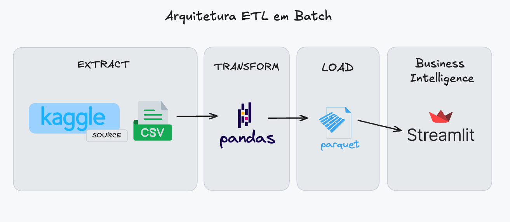
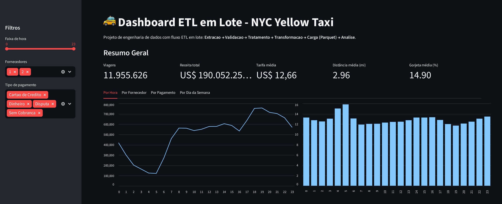
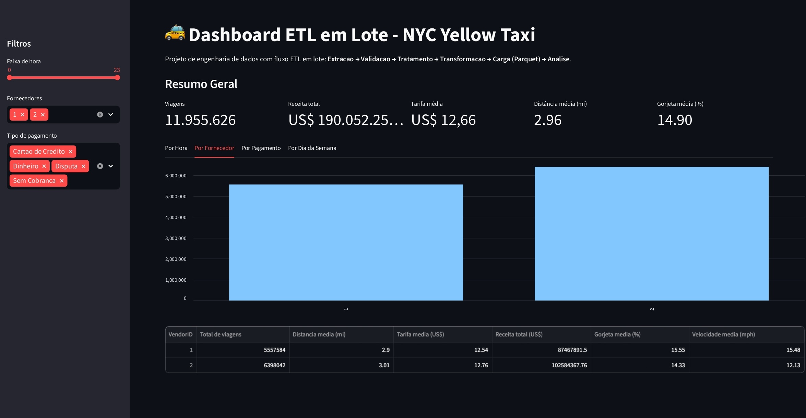
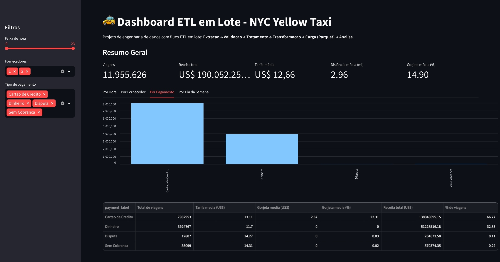
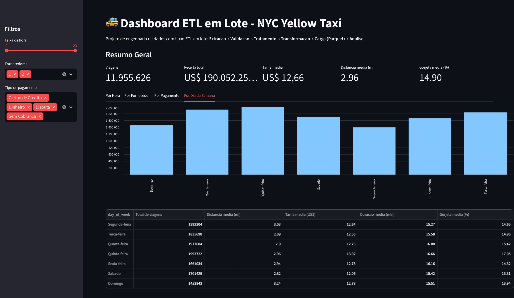

# Pipeline ETL em Batch - NYC Yellow Taxi


#### 🚕 Projeto de Engenharia de Dados com pipeline ETL em lote para dados de corridas de táxi de NYC, persistência em Parquet e dashboard interativo com Streamlit.

---

## Links Importantes do Tutorial

| Recurso | Link |
|--------|------|
| Vídeo no YouTube | [Assistir Tutorial Completo](https://www.youtube.com/@vbluuiza) |
| Documentação Completa | [Notion](https://dadosportodos.notion.site/Meu-Primeiro-Projeto-de-Engenharia-de-Dados-ETL-Simples-com-Dados-de-T-xi-de-NYC-326d9128b449809e9445fcbd54344346) |
| Repositório GitHub | [YT-batch-ETL-NYC--Yellow-Taxi-Data-Engineer-First-Project](https://github.com/vbluuiza/YT-batch-ETL-NYC--Yellow-Taxi-Data-Engineer-First-Project) |
| Padrão de Commits | [Guia Completo com Emojis](https://fair-organ-4e1.notion.site/Guia-Completo-de-Tipos-de-Commits-com-Emojis-1fbb292b4a8d80a685c6d7f6796e3fe5) |
| Instagram | [@vbluuiza](https://www.instagram.com/vbluuiza) |
| LinkedIn | [vbluuiza](https://www.linkedin.com/in/vbluuiza/) |

---

## Índice

- [Sobre o Projeto](#sobre-o-projeto)
- [Arquitetura do Pipeline](#arquitetura-do-pipeline)
- [Dashboard](#dashboard)
- [Stack Tecnológica](#stack-tecnológica)
- [Estrutura do Projeto](#estrutura-do-projeto)
- [Pré-requisitos](#pré-requisitos)
- [Instalação e Configuração](#instalação-e-configuração)
- [Como Executar](#como-executar)
- [Contato](#contato)

---

## Sobre o Projeto

Este repositório mostra um fluxo ETL completo em batch usando dados reais de Yellow Taxi de NYC.

O pipeline cobre as etapas de:

1. Extração dos dados CSV
2. Validação e tratamento de qualidade de dados
3. Transformação e criação de métricas
4. Agregações para análise
5. Persistência em formato Parquet
6. Visualização no Streamlit

Objetivo: servir como projeto-base para quem quer estudar e reproduzir um processo de Engenharia de Dados ponta a ponta.

---

## Arquitetura do Pipeline



---

## Dashboard

### Visão Geral



### Análise por Fornecedor



### Análise por Pagamento



### Análise por Dia da Semana



---

## Stack Tecnológica

| Camada | Tecnologia | Versão | Por que usamos |
|--------|------------|--------|----------------|
| Core | Python | 3.14+ | Linguagem principal para construir o ETL e o dashboard. |
| Core | Streamlit | 1.44+ | Cria o dashboard interativo rapidamente, sem precisar de front-end. |
| Biblioteca Python | pandas | 2.2+ | Faz limpeza, transformação, agregações e análise tabular dos dados. |
| Biblioteca Python | pyarrow | 19.0+ | Leitura e escrita de Parquet com boa performance em formato colunar. |
| Biblioteca Python | ipykernel | 7.2+ | Conecta o ambiente Python ao Jupyter Notebook. |
| Ferramenta | Jupyter Notebook | - | Desenvolvimento e validação passo a passo do pipeline ETL. |
| Ferramenta | UV | - | Gerencia dependências e execução do projeto de forma rápida e reprodutível. |

---

## Estrutura do Projeto

```text
├── data/
│   ├── yellow_tripdata_2016-03.csv
│   └── output/
│       └── yellow_taxi_2016-03.parquet
├── notebooks/
│   └── main.ipynb
├── dashboard.py
├── DATASET.md
├── pyproject.toml
└── uv.lock
```

> Observação: a pasta `data/` não foi subida para o GitHub neste repositório.
> Para reproduzir o projeto, gere os arquivos localmente executando o notebook em `notebooks/main.ipynb`.

---

## Pré-requisitos

- Python 3.14 ou superior
- UV instalado

Instalação do UV (caso precise):

```bash
pip install uv
```

---

## Instalação e Configuração

### 1) Clone o repositório

```bash
git clone https://github.com/vbluuiza/YT-batch-ETL-NYC--Yellow-Taxi-Data-Engineer-First-Project.git
cd YT-batch-ETL-NYC--Yellow-Taxi-Data-Engineer-First-Project
```

### 2) Sincronize dependências

```bash
uv sync
```

---

## Como Executar

### Opção A: executar pipeline no notebook

```bash
uv run jupyter notebook
```

Depois abra `notebooks/main.ipynb` e execute as células para gerar o parquet em `data/output/yellow_taxi_2016-03.parquet`.

### Opção B: executar dashboard Streamlit

```bash
uv run streamlit run dashboard.py
```

O dashboard será aberto no navegador local.

---

## Contato

vbluuiza | luuiza.empresarial@gmail.com

[](https://youtube.com/@vbluuiza)
[](https://www.instagram.com/vbluuiza)
[](https://www.linkedin.com/in/vbluuiza/)
[](https://github.com/vbluuiza)

---

Se este projeto te ajudou:

1. Dê uma star no repositório ⭐ 
2. Inscreva-se no canal [@vbluuiza](https://youtube.com/@vbluuiza) 🩷
3. Deixe seu like no vídeo 👍 
4. Comente com dúvidas e sugestões 💬 

---

<div align="center">

**Feito com ❤️ por [@vbluuiza](https://youtube.com/@vbluuiza)**


</div>